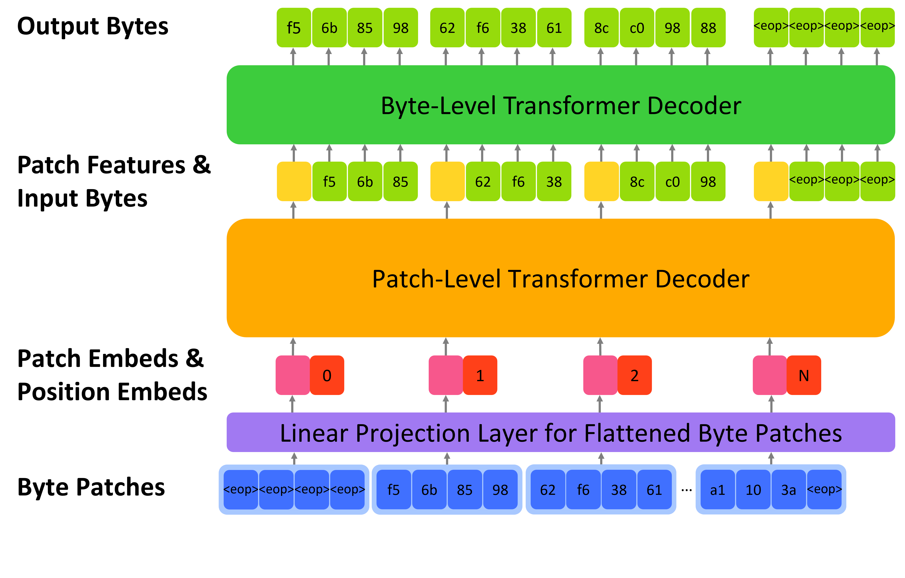
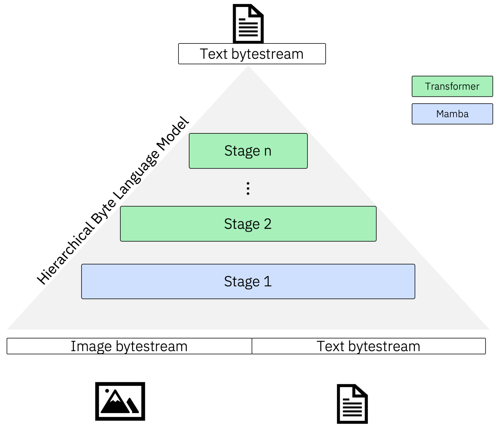
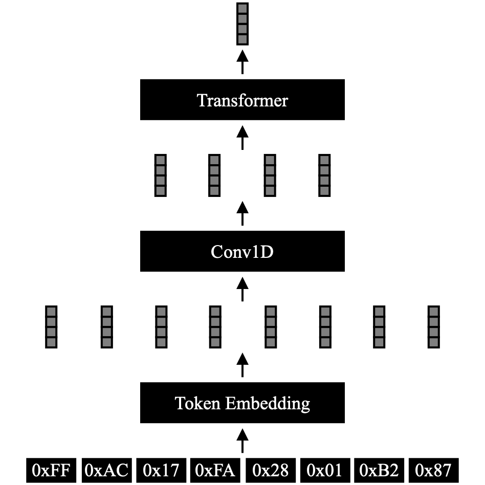

# 字节模型梳理与 ByteFormer 选择

## 1. 什么是字节模型

计算机中的文本、图像、音频、视频和程序最终都以字节保存。字节模型直接把 `0–255` 作为基本符号，在原始字节序列上学习规律，不必先把输入切分成单词 token，也不必为每种文件格式设计完全不同的输入接口。

这类模型首先要解决两个问题：一是字节序列远长于常用 token 序列，二是局部字节与文件整体结构需要同时建模。现有工作主要采用分块层级结构、状态空间模型、多尺度结构或卷积下采样来降低长序列计算量。

## 2. 代表性字节模型

| 模型 | 发表时间 | 主要结构 | 典型任务 | 开源情况与资料 |
| --- | ---: | --- | --- | --- |
| ByT5 | 2021 | UTF-8 字节输入的 Transformer 编码器—解码器 | 文本理解与生成 | 已开源；[论文](https://arxiv.org/abs/2105.13626)及公开模型 |
| MEGABYTE | 2023 | 全局模型处理 byte patch，局部模型预测 patch 内字节 | 超长字节序列生成 | 未找到官方实现；[论文](https://arxiv.org/abs/2305.07185)，[社区实现](https://github.com/lucidrains/MEGABYTE-pytorch) |
| ByteFormer | 2023 | 字节嵌入、卷积降采样、窗口 Transformer 编码器 | 图像、音频等文件分类 | 已开源；[论文](https://arxiv.org/abs/2306.00238)，[Apple CoreNet](https://github.com/apple/corenet/tree/main/projects/byteformer)及预训练权重 |
| MambaByte | 2024 | 直接在字节序列上使用选择性状态空间模型 | 长文本字节语言建模 | 已开源；[论文](https://arxiv.org/abs/2401.13660)，[官方代码与权重](https://github.com/jxiw/MambaByte) |
| bGPT | 2024 | patch-level decoder 建模字节块关系，byte-level decoder 生成块内字节 | 文本、图像、音频、文件转换和 CPU 状态模拟 | 已开源；[论文](https://arxiv.org/abs/2402.19155)，[官方代码](https://github.com/sanderwood/bgpt)及多模态权重 |
| mBLM | 2025 | 多层级 byte patch；每一级可使用 Transformer、Mamba 等模块 | 百万级长度字节序列建模、多模态字节任务 | 已开源；[论文](https://arxiv.org/abs/2502.14553)，[官方代码](https://github.com/ai4sd/multiscale-byte-lm)及 Python 包 |
| Byte Latent Transformer | 2024 | 根据局部复杂度动态形成字节 patch | 字节级语言建模 | 已开源；[论文](https://arxiv.org/abs/2412.09871)，[官方代码](https://github.com/facebookresearch/blt) |

课堂介绍可重点保留 MEGABYTE、MambaByte、bGPT、mBLM 和 ByteFormer。ByT5 用来说明早期无 token 文本模型，Byte Latent Transformer 可作为动态分块方向的补充。

## 3. 几种主要结构的区别

### MEGABYTE：全局与局部两级生成

MEGABYTE 先把长字节序列分成固定大小的 patch。全局模型学习不同 patch 之间的关系，局部模型根据全局特征逐字节生成当前 patch。它用层级结构减少长序列自注意力的计算量。

```text
长字节序列 → byte patches → 全局模型
                              ↓
                        patch 上下文
                              ↓
                    局部模型逐字节预测
```

### MambaByte：状态空间长序列建模

MambaByte 不使用子词 tokenizer，直接处理字节。它用选择性状态空间模型沿序列递推，计算量随序列长度近似线性增长，适合比普通 Transformer 更长的字节上下文。

### bGPT：数字世界的字节生成模型

bGPT 将字节分块后，用 patch-level decoder 预测下一块的表示，再由 byte-level decoder 恢复块内字节。论文将同一套方法用于文本、图像、音频、文件格式转换和 CPU 状态建模，体现字节输入的通用性。



### mBLM：可扩展的多尺度层级

mBLM 将两级结构扩展为可配置的多层级结构。高层负责更长范围的字节关系，低层负责局部细节，每一级可以选择 Transformer 或 Mamba 模块。公开实现面向百万字节级上下文。



### ByteFormer：面向分类的字节编码器

ByteFormer 不以生成下一个字节为主要目标，而是把整个文件编码为全局特征，再完成分类。它先嵌入原始字节，通过一维卷积和多次 token merging 缩短序列，然后使用窗口自注意力与前馈网络提取特征。

```text
文件字节序列
    ↓
Byte Embedding
    ↓
Conv1D Token Reduction
    ↓
位置编码 + Window Self-Attention + FFN
    ↓
多阶段 Token Merging
    ↓
全局特征 → 分类头
```



## 4. 课程实验为什么选择 ByteFormer

| 考虑因素 | ByteFormer 的情况 |
| --- | --- |
| 与课程任务匹配 | 直接读取 JPEG 文件字节并输出类别 |
| 开源条件 | Apple 提供 CoreNet 代码和 ImageNet JPEG 预训练权重 |
| 实验复杂度 | 替换为 10 类分类头即可微调 MNIST |
| 计算资源 | 单张常见 GPU 可以完成课程规模训练 |
| 结果展示 | 可直接比较训练、验证、干净测试和受损码流测试准确率 |
| 后续扩展 | 同一模型可以读取 bit flip、byte loss 后的码流 |

因此课程先用几种字节模型说明这一研究方向，再选择 ByteFormer 完成可操作的分类实验。CBSU-ALLM、BSCV、BRACE 等受损码流工作放在加分项参考资料中，不与基础字节模型并列。
