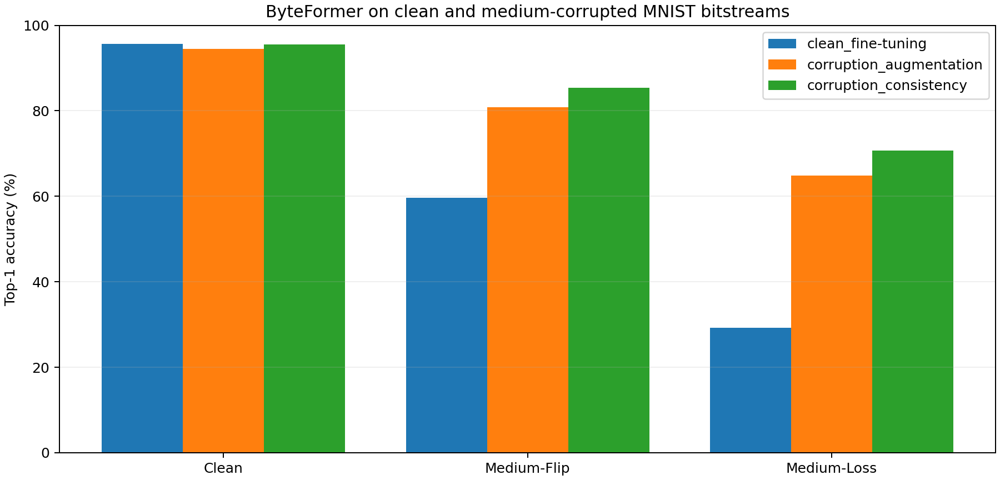

# 1/10 MNIST 码流损坏实验结果

以下结果来自固定的 1,000 张平衡测试样本。两种受损测试集与干净测试集使用相同的样本索引。

| 方法 | Clean | Medium-Flip | Medium-Loss | 受损平均 | 相对首行提升 |
| --- | ---: | ---: | ---: | ---: | ---: |
| clean_fine-tuning | 95.6% | 59.6% | 29.3% | 44.5% | +0.0 个百分点 |
| corruption_augmentation | 94.5% | 80.8% | 64.8% | 72.8% | +28.3 个百分点 |
| corruption_consistency | 95.5% | 85.4% | 70.7% | 78.0% | +33.6 个百分点 |

只用正常 JPEG 训练时，干净测试准确率为 95.6%，两种 Medium 损坏的平均准确率降到 44.5%，下降 51.1 个百分点。

corruption_consistency 的受损平均准确率为 78.0%，相对纯干净训练提高 33.6 个百分点；干净测试准确率为 95.5%。两种损坏中 byte loss 通常更困难，因为删除字节会改变后续序列位置。

每种方法的最终测试评估 JSON、逐场景 CSV 和准确率图保存在对应子目录。
